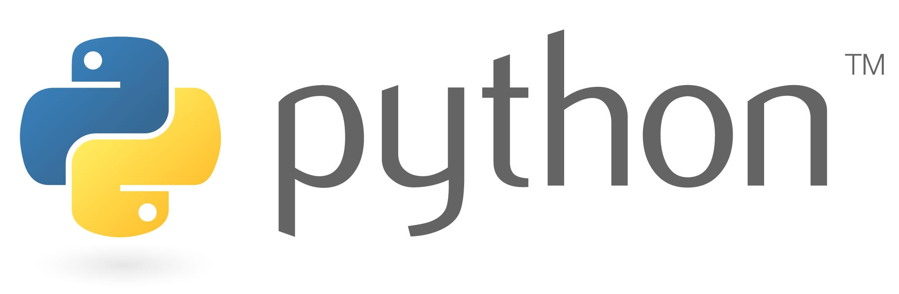
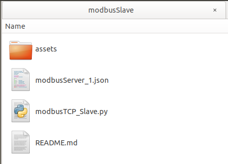
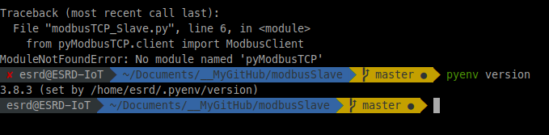
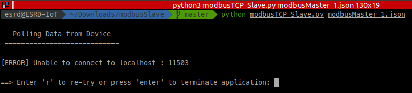

 
 

# Modbus Slave

Python solution to read data from a Modbus Master device.

DIAGRAM

## Setting everything up

Since we will be working with Python, we shall set up the environment accordingly.

Depending on the system you are working on (Ubuntu or MacOS) check in the corresponding article the chapter about how to set up Python 3.

* LINK TO HOW TO... UBUNTU
* LINK TO HOW TO... MAC OS

Once we have set up the Python environment in our computer, we can clone the project and finish setting up the development environment.

Go to the folder you want to clone the project in and clone the project

	git clone https://github.com/fcomir-io/modbusSlave.git
	
The project structure would look like this

**Note:** *assets* folder contains all images needed for this Read Me; it is not relevant for the script!

### Install pyModbusTCP library

Since the script is based on a library that requires v3.5.x, we shall set the local python version using pyenv (previously installed).

	cd /modbusMaster-Emulator
	pyenv local 3.5.9
	
You should see something like this:
	
	3.5.9 (set by {...}/modbusMaster-Emulator/.python-version)

Once the needed python version was set, install **pyModbusTCP **library

	pip install pyModbusTCP

If the library is not installed or the python version is not the expected one, the error would look like this

 

## Executing the script

Basically the script needs a json-file (passed as argument) to parse the information of the device(s) to be emulated. 
The argument passed could be 
- just the name of the file. In this case, the  script would look for it in the same path of the script.
- a complete path of the file (starting with '/'). In this case, the script would use the path directly to open the json-File.

As example the project already has a json-File [json-File Example](modbusMaster_1.json).
The file represents a Device-Object that consists on 
- Host
- Port
- Data Array (Coils and Registers)

**Note:** More information about the json-File later on this Read Me!

To start the script run the **modbusTCP_Slave.py** script giving the json-File as argument

	python modbusTCP_Server.py modbusMaster_1.json

This will start the script listening on specified port and reading specified coli/registers.

If there is no Master device on the bus, the script won't be able to connect to it, and an error will be shown:

 

## Testing the solution

To test the solution, clone the other part of the solution TODO